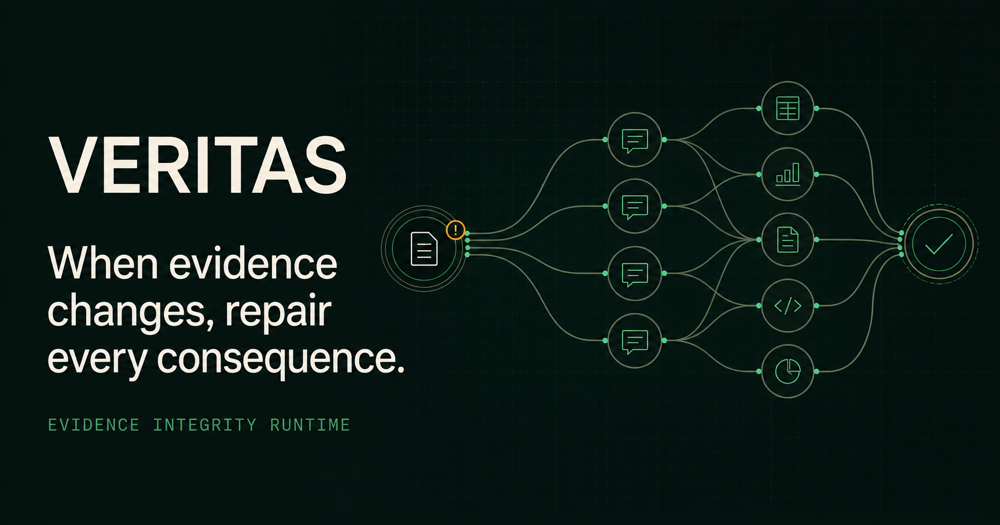
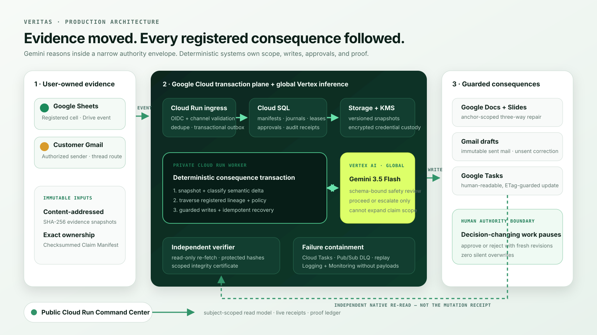

<p align="center">
  
</p>

<h1 align="center">Veritas</h1>

<p align="center">
  <strong>Autonomous consequence repair for AI-created knowledge work.</strong><br />
  When source evidence changes, Veritas repairs every registered consequence - and proves the result.
</p>

<p align="center">
  <a href="https://veritas-preview-web-602044424209.us-central1.run.app/">
    
  </a>
  
  
  
</p>

<p align="center">
  <a href="https://veritas-preview-web-602044424209.us-central1.run.app/"><strong>Launch Veritas</strong></a>
  &nbsp;&middot;&nbsp;
  <a href="https://youtu.be/J_SbOBDYlPg"><strong>Watch the 4-minute demo</strong></a>
  &nbsp;&middot;&nbsp;
  <a href="docs/submission/judge-testing.md"><strong>Judge testing guide</strong></a>
  &nbsp;&middot;&nbsp;
  <a href="docs/submission/live-proof-report.md"><strong>Production proof</strong></a>
</p>

---

## The integrity gap after generation

AI can generate a strategy memo, executive deck, investor email, and execution plan in seconds. Then a source metric changes - and every artifact quietly becomes inconsistent.

Regenerating everything is unsafe. Searching for similar text cannot authorize a business write. Trusting an agent's own success message is not verification.

**Veritas is the transaction layer between changed evidence and the work that depends on it.** It records exact claim ownership, detects semantic changes, calculates the registered blast radius, executes minimal repairs through native Google Workspace APIs, preserves human edits, and independently verifies the result.

| Conventional automation | Veritas |
|---|---|
| Waits for another prompt | Reacts to authenticated evidence events |
| Guesses dependencies from similarity | Traverses a checksummed Claim Manifest |
| Regenerates whole artifacts | Applies typed, anchor-scoped repairs |
| Lets the model decide and write | Separates model reasoning from deterministic authority |
| Reports its own success | Re-reads every target with an independent verifier |
| Treats approval as UI decoration | Persists approval as a revision-bound authority grant |

## Live proof, not a hypothetical

The canonical production run begins with one real edit: `Metrics!B17` in a native Google Sheet changes from **4% to 9%**. No repair prompt follows.

| Result | Verified outcome |
|---|---:|
| Affected claims | **4** |
| Repaired Workspace artifacts | **5** |
| Exact registered paths | **9** |
| Inferred write paths | **0** |
| Independently verified targets | **13/13** |
| Human edits lost | **0** |

Veritas updates owned content across Google Docs, Slides, Gmail drafts, and Google Tasks; pauses decision-changing consequences for two explicit human approvals; leaves sent email immutable; preserves protected human prose; and issues a scoped integrity certificate only after every registered target has been re-read.

The public Command Center is a read-only, replayable evidence room so judges can inspect the complete incident without access to the entrant's private Workspace. The [submission video](https://youtu.be/J_SbOBDYlPg) shows the authenticated path against real Google Workspace resources and Google Cloud services.

## How the autonomous transaction works

```text
authenticated evidence event
        |
        v
immutable, content-addressed snapshot
        |
        v
semantic delta + Gemini safety review
        |
        v
checksummed Claim Manifest traversal
        |
        v
typed repair plan + policy/approval gates
        |
        v
minimal native Workspace writes
        |
        v
independent native re-read
        |
        v
scoped integrity certificate
```

1. **Capture** - authenticated Drive or Gmail ingress is validated, deduplicated, and bound to an immutable snapshot.
2. **Interpret** - Gemini 3.5 Flash reviews the semantic change and returns a schema-bound `proceed` or `escalate` decision.
3. **Trace** - Veritas follows only relationships registered in the versioned Claim Manifest. Candidate similarity never grants write authority.
4. **Plan** - deterministic policy produces typed operations for every affected target.
5. **Authorize** - factual repairs may continue automatically; decision-changing or ambiguous work pauses at the human authority boundary.
6. **Repair** - native adapters perform revision-preconditioned, idempotent writes while preserving unregistered human content.
7. **Verify** - a separate read-only verifier re-fetches every target and issues a certificate only at complete registered coverage.

## Production architecture

<p align="center">
  
</p>

| Layer | Production implementation |
|---|---|
| Bounded reasoning | Gemini 3.5 Flash on Vertex AI through Google Gen AI SDK |
| Compute | Cloud Run web, API, authenticated ingress, private worker, and migration job |
| Durable state | Cloud SQL for PostgreSQL - manifests, journals, leases, approvals, receipts |
| Events and recovery | Pub/Sub, Cloud Tasks, Cloud Scheduler, transactional outbox, dead-letter replay |
| Evidence custody | Versioned Cloud Storage snapshots protected with Cloud KMS |
| Secrets and identity | Secret Manager, dedicated service accounts, OIDC, least-privilege IAM |
| Native actions | Google Drive, Sheets, Docs, Slides, Gmail, and Tasks APIs |
| Observability | Structured Cloud Logging, metrics, alerts, and payload-free operational telemetry |
| Delivery | Artifact Registry, Cloud Build, Terraform, Docker |

### The model reasons inside a narrow authority envelope

Gemini is deliberately powerful where semantic judgment is needed and deliberately powerless where authority must be deterministic.

| Gemini may | Gemini may not |
|---|---|
| Interpret the registered semantic delta | Add new claims or relationships |
| Identify ambiguity and risk flags | Write outside the Claim Manifest |
| Recommend `proceed` or `escalate` | Approve decision-changing actions |
| Produce a schema-validated reasoning receipt | Override revision or ETag conflicts |
| Veto unsafe work | Certify its own mutations |

Every structured model decision is schema-validated, checksummed, and persisted as an inspectable receipt. Scope, credentials, policy, approvals, mutations, retries, and certification remain deterministic.

## Product surfaces

| Surface | What it proves |
|---|---|
| **Command center** | Source before/after evidence, outcome metrics, and final certificate state |
| **Live run** | Seven persisted stages, Gemini receipt, execution terminal, and causal graph |
| **Email -> Task** | Authorized customer email routed to exactly one manifest-bound Google Task |
| **Repair desk** | Automatic, approval-required, draft-only, conflict, and recovery lanes |
| **Blast radius** | Exact evidence-to-claim-to-artifact paths with zero inferred authority |
| **Proof ledger** | Native resource links, versions, hashes, receipts, and preservation evidence |
| **Verification** | Independent target re-reads and the scoped integrity certificate |
| **Architecture** | Google Cloud trust boundaries and the reusable packet contract |

## Judge quick start — no account required

1. Open the [public Cloud Run Command Center](https://veritas-preview-web-602044424209.us-central1.run.app/).
2. Select **Open offline judge demo**. Replay data is visibly labelled and is never substituted for live data silently.
3. Follow the navigation from **Command center** through **Architecture**.
4. Use **Replay incident** to watch the persisted transaction progress without refreshing.
5. Open [the readiness endpoint](https://veritas-preview-web-602044424209.us-central1.run.app/health/ready); a healthy release returns HTTP 200.
6. Compare the walkthrough with the [production proof report](docs/submission/live-proof-report.md) and [claim-to-evidence matrix](docs/submission/claim-evidence-matrix.md).

The public path cannot mutate the entrant's Workspace. The authenticated path is intentionally subject-scoped because it can read and update real Docs, Slides, Gmail drafts, and Tasks.

## Local spin-up

### Prerequisites

- Git
- Node.js 22 and Corepack
- Python 3.12 and [`uv`](https://docs.astral.sh/uv/)
- Docker with Compose for the containerized preview
- Terraform and Google Cloud CLI only for Cloud deployment

### Install and run the complete verification gate

```bash
git clone https://github.com/RudraBhaskar9439/veritas.git
cd veritas

corepack enable
corepack prepare pnpm@11.8.0 --activate
pnpm install --frozen-lockfile
uv sync --all-packages --dev --frozen

node scripts/verify-phase-12.mjs
```

The cumulative phase-12 gate runs Python linting, formatting, typing, backend tests with the coverage threshold, frontend linting/type checks/tests/build, Terraform validation, container builds, the deterministic evaluation, and five reproducible demo rehearsals.

Accepted evidence at the time of submission:

- **236** backend tests
- **30** frontend tests
- **90.13%** backend coverage
- **40/40** deterministic evaluation scenarios
- **5/5** deterministic demo rehearsals

### Run the browser experience

```bash
pnpm --filter @veritas/web dev
```

Open <http://127.0.0.1:5173/> and choose **Open offline judge demo**.

### Run the containerized preview

```bash
docker compose up --build
```

Open <http://127.0.0.1:3000/>. Runtime liveness is available at <http://127.0.0.1:8080/health/live>.

The local services intentionally start without real OAuth credentials. `/health/ready` therefore remains `503 not_ready`, and live Google actions stay disabled until a real environment is configured.

Stop the preview with:

```bash
docker compose down
```

## Configure a real Google Workspace environment

> [!CAUTION]
> A real environment can read and update Google Workspace resources. Use a dedicated test account and review the declared scopes before connecting it.

1. Copy [`config/example.env`](config/example.env) to an untracked local environment file and replace every `YOUR_...` placeholder.
2. Create a Google OAuth web client, configure the exact callback and origin, add consent-screen test users, and enable Drive, Sheets, Docs, Slides, Gmail, and Tasks APIs.
3. Provision the resources in [`infra/terraform`](infra/terraform) and add application and OAuth secrets directly to Secret Manager.
4. Run the Terraform-created migration job before routing traffic.
5. Connect the dedicated Workspace account, generate a monitored packet, and change a registered Sheet cell.
6. Approve decision-changing consequences only after reviewing the fresh source and target revisions.

Veritas has no email-send endpoint. It reads authorized inbound messages, creates unsent correction drafts, and updates only manifest-bound Tasks. Full setup, IAM, OAuth, budget, migration, watch-renewal, and rollout instructions are in the [Cloud deployment runbook](docs/runbooks/cloud-deployment.md).

## Cloud deployment

The committed Terraform and Cloud Build definitions reproduce the production topology.

```bash
gcloud builds submit \
  --config cloudbuild.preview.yaml \
  --substitutions=_IMAGE_TAG=YOUR_COMMIT_SHA .

terraform -chdir=infra/terraform init
terraform -chdir=infra/terraform plan -var='project_id=YOUR_PROJECT_ID'
terraform -chdir=infra/terraform apply -var='project_id=YOUR_PROJECT_ID'
```

Use immutable Artifact Registry digests in `service_images`, inspect every Terraform plan, run migrations before traffic, and verify `/health/ready` after rollout.

## Repository map

```text
veritas/
|- apps/web/                 React + TypeScript Command Center
|- services/runtime/         FastAPI runtime, worker, adapters, verifier
|- schemas/                  Claim Manifest and typed contracts
|- infra/terraform/          Reproducible Google Cloud infrastructure
|- fixtures/demo/            Versioned packet inputs and expected outcomes
|- scripts/                  Phase gates, evaluation, and demo rehearsal
|- docs/
|  |- architecture-decisions/ Security and design records
|  |- runbooks/               Deployment and operations
|  |- submission/             Judge guide, proofs, diagram, disclosures
|  `- verification/           Accepted phase evidence
`- compose.yaml               Local PostgreSQL + API + web preview
```

## Safety and integrity properties

- **Manifest-bound scope:** only checksummed, registered relationships can authorize a write.
- **Minimal mutation:** adapters change owned anchors, not whole artifacts.
- **Human preservation:** revision preconditions, protected hashes, and three-way merge prevent silent overwrites.
- **Immutable sent mail:** corrections become unsent drafts linked to the original message.
- **Durable recovery:** idempotency, leases, bounded retries, quarantine, and audited replay contain failure.
- **Independent verification:** the mutation worker cannot issue its own certificate.
- **Scoped claims:** Veritas certifies consistency only for monitored claims, registered targets, and pinned evidence versions - never universal truth.
- **Credential hygiene:** secrets, OAuth tokens, billing identifiers, and database passwords are absent from the repository.

See the [system architecture](docs/architecture.md), [verification strategy](docs/verification-strategy.md), [implementation disclosures](docs/submission/disclosures.md), and [live proof limits](docs/submission/live-proof-report.md) for the exact guarantees and explicitly incomplete evidence.

## Hackathon submission

Built for the **Google All Things Agentic Hackathon**.

- **Primary track:** The Taskmaster
- **Additional prize targets:** Best Architectural Design and Individual/Hobbyist
- **Runtime model:** Gemini 3.5 Flash on Vertex AI
- **Google agent framework:** Google Gen AI SDK
- **Demo:** [Veritas - When Data Changes, Every Consequence Repairs Itself](https://youtu.be/J_SbOBDYlPg)

### Submission evidence

- [Architecture diagram](docs/submission/veritas-architecture.svg)
- [Judge testing guide](docs/submission/judge-testing.md)
- [Live production proof](docs/submission/live-proof-report.md)
- [Cloud proof manifest](docs/submission/cloud-proof-manifest.json)
- [Claim-to-evidence matrix](docs/submission/claim-evidence-matrix.md)
- [Implementation and reuse disclosures](docs/submission/disclosures.md)
- [Four-minute recording runbook](docs/submission/recording-runbook.md)

---

<p align="center">
  <strong>Do not build a better planner. Build the agent that repairs what happens when reality changes.</strong>
</p>
