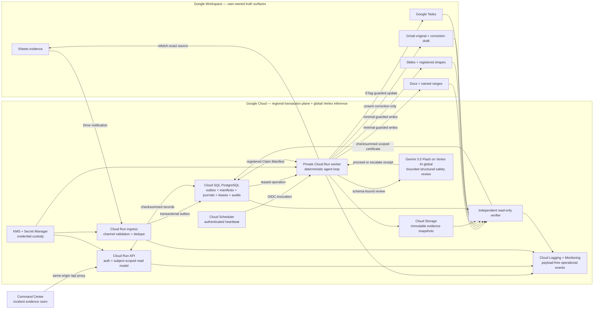
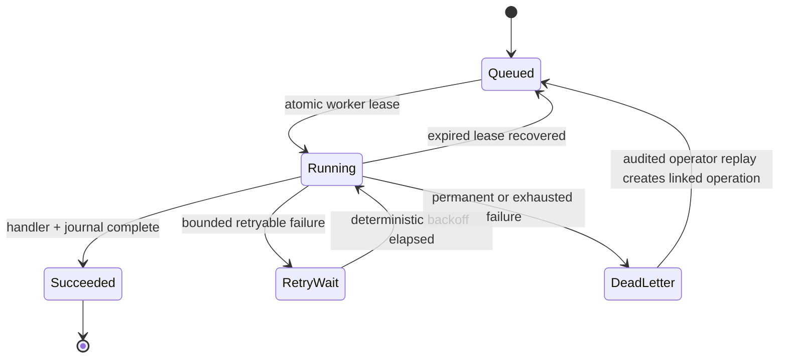

# Veritas production architecture

## Why the architecture matters

The worker is not a brittle chain of browser calls. Gemini 3.5 Flash, accessed through Google's Gen AI SDK on Vertex AI's supported global inference endpoint, reviews the already-scoped impact and plan and may force human escalation. The stateful transaction plane remains in `us-central1`. Durable deterministic code still owns evidence versions, semantic classification, registered graph traversal, policy, native API preconditions, idempotency, leases, checksums, and certificate eligibility. The model cannot invent scope or authorize itself. Each meaningful change advances automatically through the complete lifecycle under one correlation root.

The mutation path and verification path are separate. A successful write response is never accepted as proof. The verifier independently re-reads every registered target and compares protected-content hashes captured before mutation.

## Failure boundaries

Human edit conflicts and source movement do not silently retry into an overwrite. They stop the run, prevent certification, and surface the exact registered boundary requiring review.
