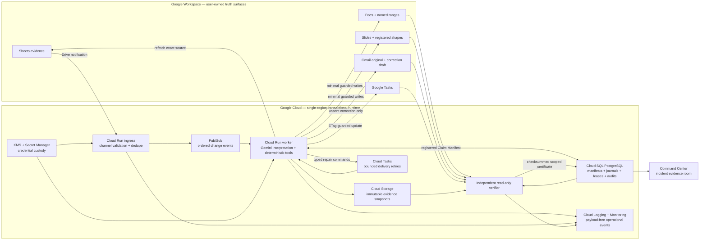
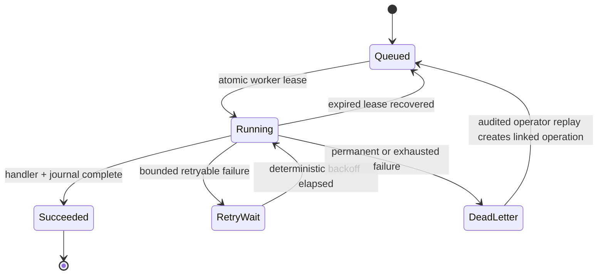

# Veritas production architecture

## Why the architecture matters

The model is not the transaction coordinator. Gemini may interpret whether a source change is meaningful and help propose a repair, but deterministic code owns evidence versions, registered graph traversal, policy, native API preconditions, idempotency, leases, checksums, and certificate eligibility.

The mutation path and verification path are separate. A successful write response is never accepted as proof. The verifier independently re-reads every registered target and compares protected-content hashes captured before mutation.

## Failure boundaries

Human edit conflicts and source movement do not silently retry into an overwrite. They stop the run, prevent certification, and surface the exact registered boundary requiring review.

